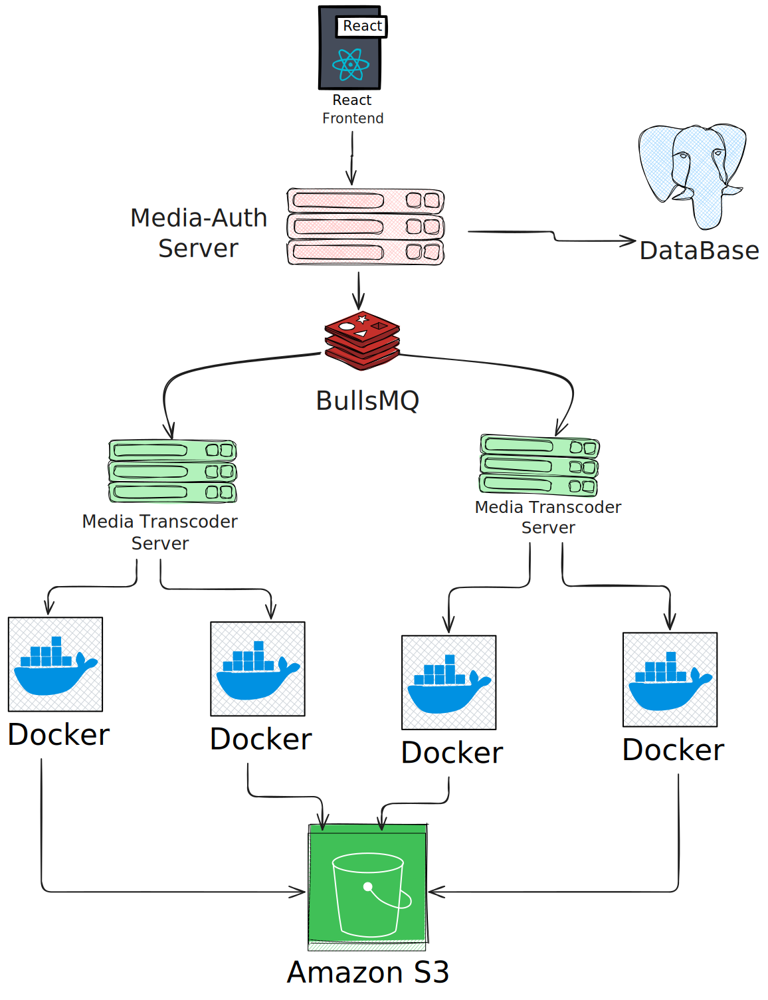

# StreamHive

StreamHive is a video streaming platform where you can upload video using multipart upload and videos will get transcoded to multiple resoultions and will be stored in S3.
## Architecture Diagram

## Components

### Media Authentication Service (media-auth)

The media authentication service ensures secure access to content through comprehensive authentication and authorization mechanisms.

### Media Transcoder Service (media-transcoder) 

The media transcoder service optimizes video content for the best possible viewing experience across all devices and network conditions.

### Frontend (frontend)
The frontend is the user interface that allows users to browse, upload, and watch videos.
